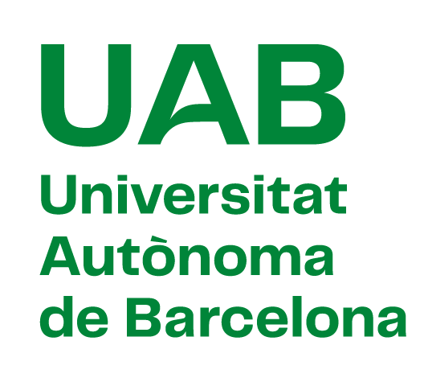

{.logo-animated fig-align="center"}

::: {.home-partners style="display: flex; justify-content: center; align-items: center; flex-wrap: wrap;"}
 {width="174"}
:::

**Projecte de recerca finançat per**

::: {.home-funding style="display: flex; justify-content: center; align-items: center;"}

:::

```{=html}
<script defer src="https://cdn.overtracking.com/t/tJ4dxONKAlXCjw0k8/"></script>
```
