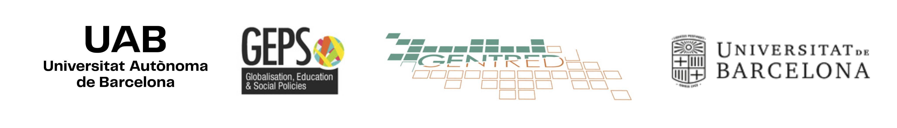
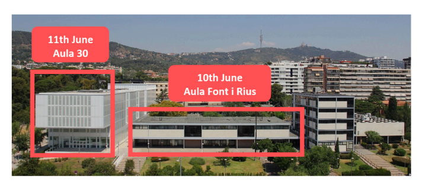

::: {style="text-align: center; margin: 0 auto;"}
# SEMINARI INTERNACIONAL

### **TRANSFORMACIONS URBANES, CANVI DEMOGRÀFIC I DESIGUALTATS EDUCATIVES ESPACIALS A LES CIUTATS GLOBALS**

**Barcelona**

**10 - 11 de juny de 2025**

:::

## Justificació

La transformació urbana i la reconfiguració socioespacial són forces clau que modelen les societats contemporànies. La globalització ha aprofundit la fragmentació i la polarització social, impulsant desigualtats i transformant els paisatges urbans. Des de mitjan anys setanta, l’augment de la desigualtat social i l’afebliment de la capacitat dels governs nacionals i locals per contrarestar-la han intensificat la segregació residencial i les desigualtats econòmiques. La naturalesa de la segregació i d’altres desigualtats espacials varia entre ciutats globals, condicionada per les històries urbanes, la reestructuració econòmica, els canvis en l’estat del benestar i les polítiques d’habitatge.

En els darrers anys, aquestes tendències s’han accelerat arran de canvis demogràfics significatius. Els fluxos migratoris i les polítiques urbanes han alterat la composició social dels barris i de les escoles, mentre que la turistificació i la gentrificació han transformat els paisatges urbans i han influït en les desigualtats educatives. Al mateix temps, les polítiques urbanes i educatives han adoptat cada vegada més enfocaments neoliberals, visibles en la liberalització del mercat de l’habitatge i en l’expansió de les polítiques d’elecció escolar.

La interacció entre les transformacions urbanes i les polítiques educatives és central per entendre la configuració de les desigualtats socioespacials en educació. La reestructuració espacial influeix en les jerarquies escolars, reconfigura els mercats educatius locals i reforça els vincles entre segregació residencial i segregació escolar. Aquestes dinàmiques s’entrecreuen amb les polítiques d’admissió escolar, la diversificació de l’oferta educativa i la redefinició de les zones escolars, sovint amb efectes incerts sobre les desigualtats socioespacials. Les interaccions complexes entre els mercats d’habitatge, les polítiques educatives i les estratègies familiars generen noves formes de desigualtat educativa que continuen sent insuficientment explorades. Aquest seminari reuneix investigadors i investigadores de diversos contextos urbans i disciplines per examinar com el canvi urbà, les desigualtats espacials i les polítiques educatives s’entrecreuen en la configuració de les desigualtats educatives. Els temes principals inclouen:

- L’impacte de les transformacions urbanes, les migracions i els canvis demogràfics en la segregació escolar.

- El paper de les polítiques d’elecció escolar, les regulacions i processos d’admissió, i les estratègies parentals en la configuració de les desigualtats educatives.

- Els patrons d’elecció escolar i de mobilitat de l’alumnat en entorns urbans.

- Les interseccions entre polítiques d’habitatge, renovació urbana i accés educatiu.

- Els efectes de la gentrificació en la composició escolar i els resultats educatius. Respostes polítiques i intervencions per reduir la segregació escolar i promoure l’equitat.

::: {style="text-align: center; margin: 0 auto;"}
**Coordinat per**

Xavier Bonal (UAB), Sheila González (UB), Adrián Zancajo (UAB)
:::

## Programa

### 10 de juny — Aula Font i Rius (edifici històric)

### 09:00 Benvinguda i introducció

### 09:30 Sessió 1. Canvi urbà i demogràfic a la ciutat global

**Presideix:** Xavier Bonal

- *Canvi de barris i transformacions poblacionals a les ciutats del sud d’Europa: processos i tendències clau*\
  **Antonio López Gay**

- *Les mutacions de la segregació residencial: més enllà de la gentrificació*\
  **Daniel Sorando**

- *Especialització residencial i desigualtat entre municipis: tendències a la regió metropolitana de Barcelona*\
  **Ismael Blanco**

### 11:00 Pausa cafè

### 11:30 Sessió 2. Nous patrons de segregació escolar en entorns urbans

**Presideix:** Isabel Ramos Lobato

- *Segregació interseccional: conceptualització i aplicació al cas de l’escolarització al Brasil*\
  **Rob J. Gruijters**

- *Transicions educatives situades: com la composició de l’escola local afecta les trajectòries educatives*\
  **Costanzo Ranci & Francisco Gabriel Ferraioli**

- *Configuració de la segregació escolar i de classe: el paper de les pràctiques institucionals i quotidianes dels centres*\
  **Marta Cordini, Carlotta Casiagli, Giulia Marroccoli & Berenice Scandone**

### 13:00 Dinar

### 14:30 Sessió 3. Elecció escolar en entorns urbans canviants

**Presideix:** Quentin Ramond

- *Elecció escolar i accés a escoles efectives*\
  **Ellen Greaves**

- *Les famílies gentrificadores fugen de les escoles locals? Un estudi de cas de Barcelona*\
  **Xavier Bonal & Sheila González**

- *Elecció escolar i desigualtats espacials: un experiment d’enquesta sobre les preferències parentals per escoles de primària en diferents barris*\
  **Håkan Forsberg & Andreas Alm Fjellborg**

### 16:00 Pausa cafè

### 16:30 Sessió 4. Respostes dels actors a les transformacions urbanes i demogràfiques

**Presideix:** Sheila González

- *Participació de persones immigrades en barris de nova arribada: les escoles com a espais de trobada?*\
  **Isabel Ramos Lobato**

- *Segregació del professorat en el marc de la provisió del mercat laboral, la segregació escolar i la segregació residencial*\
  **Sonja Kosunen**

- *Experiències emocionals i estigma entre beneficiaris de les polítiques de desegregació de Barcelona*\
  **Andrea Jover, Martí Manzano, Berta Llos & Andreu Termes**

### 20:00 Sopar social — *Restaurant Pomarada*

### 11 de juny — Aula 30 (edifici nou)

### 09:30 Sessió 5. Efectes de barri i segregació escolar

**Presideix:** Adrián Zancajo

- *El paper dels barris de l’entorn de les escoles en l’elecció escolar i la segregació escolar*\
  **Quentin Ramond**

- *Reputació del barri, elecció escolar i segregació escolar*\
  **Eduardo Tapia**

- *Gentrificació i canvi escolar: explorant els dilemes de la diversitat en l’espai educatiu local*\
  **Marcel Pagès, Pablo Neut & Nur Garcia-Borés**

### 11:00 Pausa cafè

### 11:30 Sessió 6. Polítiques educatives per abordar la segregació escolar

**Presideix:** Marta Cordini

- *La zonificació escolar ajuda a reduir la segregació escolar? Lliçons de França*\
  **Marco Oberti & Lise Lécuyer**

- *Impactes i efectes de les polítiques de desegregació a Barcelona*\
  **Adrián Zancajo, Sheila González & Edgar Quilabert**

- *Quan regular la selectivitat escolar no és suficient: límits del sistema centralitzat d’admissió escolar xilè per reduir la desigualtat*\
  **Alejandro Carrasco**

## Lloc

[Facultat de Dret (Universitat de Barcelona)](https://maps.app.goo.gl/6n9g3wmUGi8G2uPx6) Avinguda Diagonal 684, 08034 Barcelona

### Aules del seminari

10 de juny: l’Aula Font i Rius es troba a la primera planta de l’edifici principal (edifici històric) de la Facultat de Dret.

11 de juny: l’Aula 30 es troba a la planta baixa de l’edifici nou.

## Llista de participants

| Nom                   | Institució                        |
|-----------------------|-----------------------------------|
| Ismael Blanco         | IGOP-UAB                          |
| Xavier Bonal          | GEPS-UAB                          |
| Alejandro Carrasco    | Universidad Católica de Chile     |
| Marta Cordini         | Politecnico di Milano             |
| Sheila González Motos | Universitat de Barcelona          |
| Ellen Greaves         | University of Exeter              |
| Rob J. Gruijters      | University of Bristol             |
| Francisco Ferraioli   | Politecnico di Milano             |
| Andreas Alm Fjellborg | Uppsala University                |
| Håkan Forsberg        | Uppsala University                |
| Nur Garcia-Borés      | GEPS-UAB                          |
| Andrea Jover          | GEPS-UAB                          |
| Sonja Kosunen         | University of Eastern Finland     |
| Lise Lécuyer          | Sciences Po                       |
| Antonio López-Gay     | CED-UAB                           |
| Berta Llos            | GEPS-UAB                          |
| Martí Manzano         | GEPS-UAB                          |
| Giulia Marroccoli     | Politecnico di Milano             |
| Pablo Neut            | GEPS-UAB                          |
| Marco Oberti          | Science Po                        |
| Marcel Pagès          | Universitat de Barcelona          |
| Edgar Quilabert       | GEPS-UAB                          |
| Quentin Ramond        | Mayor University, Chile           |
| Isabel Ramos Lobato   | ILS-Dortmund                      |
| Costanzo Ranci        | Politecnico di Milano             |
| Berenice Scandone     | Politecnico di Milano             |
| Daniel Sorando        | Universidad de Zaragoza           |
| Eduardo Tapia         | Institute of Analytical Sociology |
| Andreu Termes         | GEPS-UAB                          |
| Adrián Zancajo        | GEPS-UAB                          |

Aquest seminari està organitzat pel Grup Interdisciplinari de Polítiques Educatives (GIPE), amb el suport de la Generalitat de Catalunya (SGR-Cat 2021, Ref. 00943), i forma part del projecte *The Effects of Gentrification on Educational Inequalities* (GENTRED), finançat pel Ministeri de Ciència i Tecnologia d’Espanya (PID2022-137183NB-I00).
