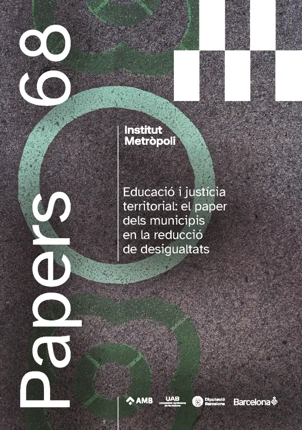

# Publications

:::::: outputs-grid
::::: output-card
::: output-cover-frame

:::

::: output-copy
### Una aproximació a la gentrificació escolar a Barcelona: mecanismes i implicacions per la política pública

**Marcel Pagès, Andreu Termes i Xavier Bonal**

A partir del cas de Barcelona, l’article analitza com processos com les migracions transnacionals i la turistificació influeixen en la gentrificació escolar. L’estudi identifica set mecanismes que expliquen aquest procés, vinculats a les estratègies escolars, els discursos pro-diversitat, l’homofília social i la reconfiguració identitària dels gentrificadors. Finalment, proposa recomanacions de política urbana i educativa per reduir els efectes negatius de la gentrificació escolar.

[Download the document](files/Revista_Papers_68_online_ART_5.pdf){.output-button target="_blank"}
:::
:::::
::::::

```{=html}
<style>
.outputs-grid {
  display: grid;
  grid-template-columns: 1fr;
  gap: 2rem;
  margin-top: 2rem;
}

.output-card {
  display: grid;
  grid-template-columns: minmax(140px, 220px) 1fr;
  gap: 1.75rem;
  align-items: start;
  min-width: 0;
}

.output-cover-frame {
  aspect-ratio: 5 / 7;
  width: 100%;
  overflow: hidden;
  border: 1px solid #4B9B8A;
  background: rgba(75, 155, 138, 0.08);
  box-shadow: 0 10px 28px rgba(18, 52, 86, 0.14);
}

.output-cover {
  width: 100%;
  height: 100%;
  object-fit: cover;
  display: block;
}

.output-copy {
  padding-top: 0.25rem;
}

.output-copy h3 {
  margin-top: 0;
  margin-bottom: 0.45rem;
  color: #4B9B8A;
  font-size: 1.1rem;
  line-height: 1.25;
}

.output-authors {
  margin-bottom: 0.85rem;
  color: #333;
  font-size: 0.86rem;
  font-weight: 700;
  line-height: 1.4;
}

.output-copy p {
  font-size: 0.9rem;
  margin-bottom: 1rem;
  line-height: 1.6;
}

.output-button {
  display: inline-block;
  padding: 0.5rem 0.8rem;
  border: 2px solid #4B9B8A;
  color: #4B9B8A;
  font-size: 0.8rem;
  font-weight: 700;
  text-transform: uppercase;
  letter-spacing: 0.02em;
}

.output-button:hover,
.output-button:focus {
  background: #4B9B8A;
  color: #fff;
  text-decoration: none;
}

@media (max-width: 768px) {
  .output-card {
    grid-template-columns: 1fr;
    max-width: 360px;
    margin: 0 auto;
    gap: 1rem;
  }
}
</style>
```
