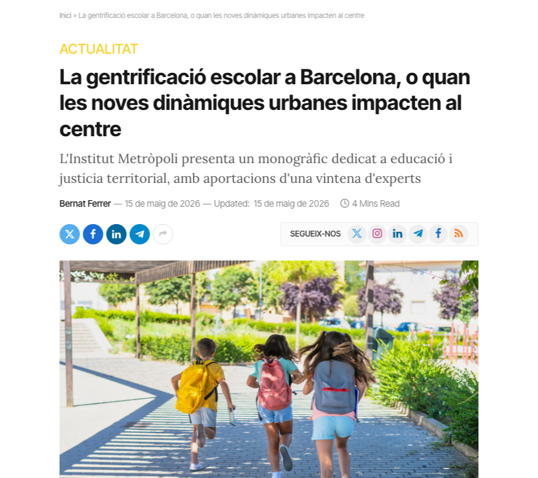
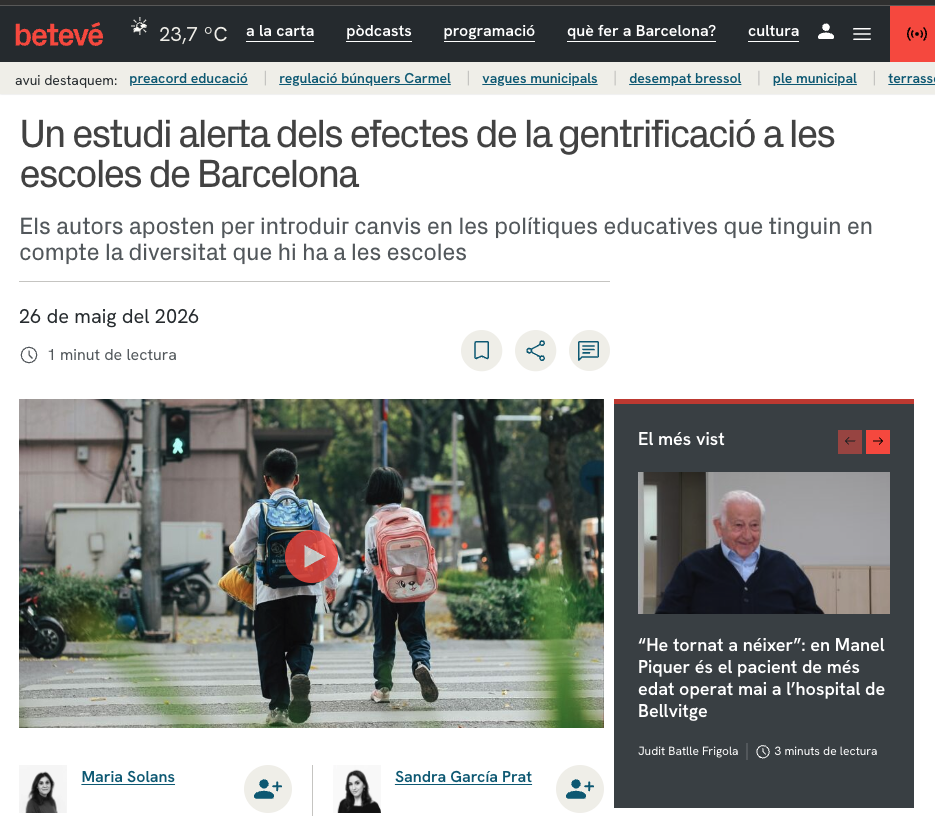
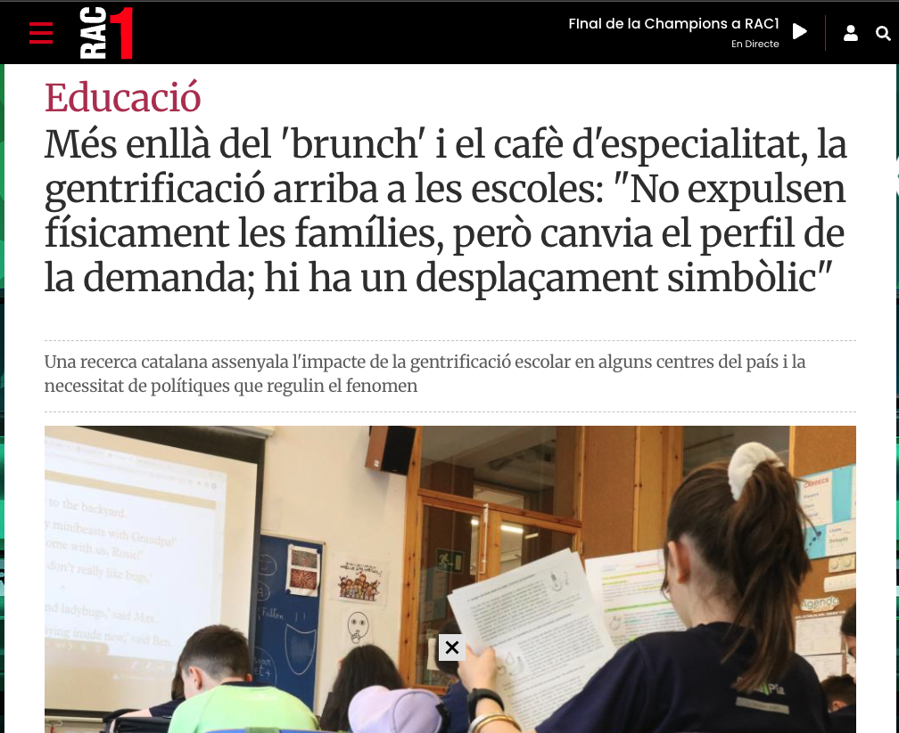
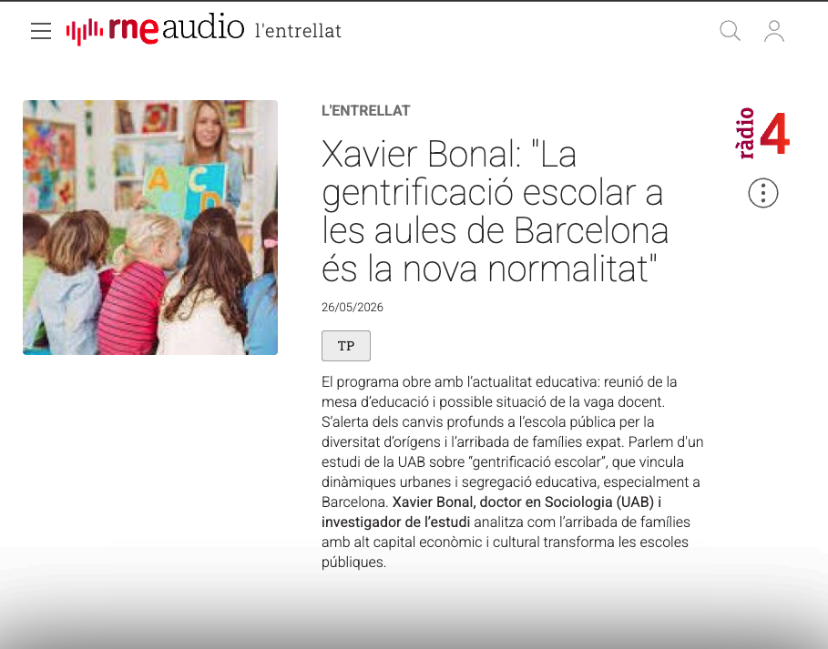

# Media

::::::::::::::: outreach-grid
::::: outreach-card
::: outreach-image-frame
[](https://educa.barcelona/2026/05/15/la-gentrificacio-escolar-a-barcelona-o-quan-les-noves-dinamiques-urbanes-impacten-al-centre/)
:::

::: outreach-copy
### [**School gentrification in Barcelona, or when new urban dynamics reach the school**](https://educa.barcelona/2026/05/15/la-gentrificacio-escolar-a-barcelona-o-quan-les-noves-dinamiques-urbanes-impacten-al-centre/){target="_blank"}

Bernat Ferrer analyses how urban change, transnational migration, and touristification shape school dynamics in Barcelona. The article argues that urban and education policies need to be planned together.
:::
:::::

::::: outreach-card
::: outreach-image-frame
[](https://www.diaripublic.cat/societat/estudi-alerta-gentrificacio-alguns-barris-barcelona-tambe-afecta-escoles.html)
:::

::: outreach-copy
### [**A study warns that gentrification in some Barcelona neighbourhoods also affects schools**](https://www.diaripublic.cat/societat/estudi-alerta-gentrificacio-alguns-barris-barcelona-tambe-afecta-escoles.html){target="_blank"}

This report explains how urban gentrification transforms the social composition of students, school dynamics, and schools’ pedagogical orientation. It highlights the risks this phenomenon may pose for educational equity.
:::
:::::

::::: outreach-card
::: outreach-image-frame
[](https://beteve.cat/societat/estudi-alerta-gentrificacio-escoles/)
:::

::: outreach-copy
### [**A study warns of the effects of gentrification on schools in Barcelona**](https://beteve.cat/societat/estudi-alerta-gentrificacio-escoles/){target="_blank"}

This piece presents the effects of gentrification on school communities, family profiles, and schools’ reputations. It emphasises the need for education policies adapted to the diversity of each neighbourhood.
:::
:::::

::::: outreach-card
::: outreach-image-frame
[](https://www.rac1.cat/societat/20260529/348793/brunch-cafe-especialitat-gentrificacio-aula-no-fisicament-desplacament-simbolic.html)
:::

::: outreach-copy
### [**Beyond brunch and specialty coffee, gentrification reaches schools**](https://www.rac1.cat/societat/20260529/348793/brunch-cafe-especialitat-gentrificacio-aula-no-fisicament-desplacament-simbolic.html){target="_blank"}

The article explores the impacts of gentrification on schools, with particular attention to the symbolic displacement that can occur in transforming neighbourhoods. It underlines the importance of incorporating the educational dimension into urban policies.
:::
:::::
:::::::::::::::

# Interviews

:::::: outreach-grid
::::: outreach-card
::: outreach-image-frame
[](https://www.rtve.es/play/audios/l-entrellat/lentrellat-xavier-bonal-gentrificacio-escolar-ales-aules-barcelona-nova-normalitat/17086865/)
:::

::: outreach-copy
### [**L'Entrellat - Xavier Bonal: "School gentrification in Barcelona's classrooms is the new normal"**](https://www.rtve.es/play/audios/l-entrellat/lentrellat-xavier-bonal-gentrificacio-escolar-ales-aules-barcelona-nova-normalitat/17086865/){target="_blank"}

Xavier Bonal speaks on Ràdio 4’s *L'Entrellat* about school gentrification in Barcelona and its links with recent urban transformations. The interview discusses how the arrival of families with high economic and cultural capital can transform public schools.
:::
:::::
::::::

```{=html}
<style>
.outreach-grid {
  display: grid;
  grid-template-columns: 1fr;
  gap: 2rem;
  margin-top: 2rem;
}

.outreach-card {
  display: grid;
  grid-template-columns: 340px minmax(0, 1fr);
  gap: 1.75rem;
  align-items: start;
  min-width: 0;
}

.outreach-image-frame {
  width: 340px;
  height: 272px;
  box-sizing: border-box;
  overflow: hidden;
  border: 1px solid #4B9B8A;
  background: #fff;
  box-shadow: 0 10px 28px rgba(18, 52, 86, 0.14);
}

.outreach-image-frame p {
  width: 100%;
  height: 100%;
  margin: 0;
}

.outreach-image-frame a {
  display: block;
  width: 100%;
  height: 100%;
}

.outreach-image {
  width: 100%;
  height: 100%;
  object-fit: contain;
  object-position: center;
  display: block;
  transition: transform 160ms ease;
}

.outreach-image-frame a:hover .outreach-image,
.outreach-image-frame a:focus .outreach-image {
  transform: scale(1.03);
}

.outreach-copy {
  padding-top: 0.25rem;
}

.outreach-copy h3 {
  margin-top: 0;
  margin-bottom: 0.75rem;
  font-size: 1.1rem;
  line-height: 1.25;
}

.outreach-copy h3 a {
  color: #4B9B8A;
  font-weight: 800;
}

.outreach-copy h3 a:hover,
.outreach-copy h3 a:focus {
  color: #3E8B77;
}

.outreach-copy p {
  font-size: 0.9rem;
  margin-bottom: 1rem;
  line-height: 1.6;
}

@media (max-width: 768px) {
  .outreach-card {
    grid-template-columns: 1fr;
    max-width: 420px;
    margin: 0 auto;
    gap: 1rem;
  }

  .outreach-image-frame {
    aspect-ratio: 5 / 4;
    width: 100%;
    height: auto;
  }
}
</style>
```
