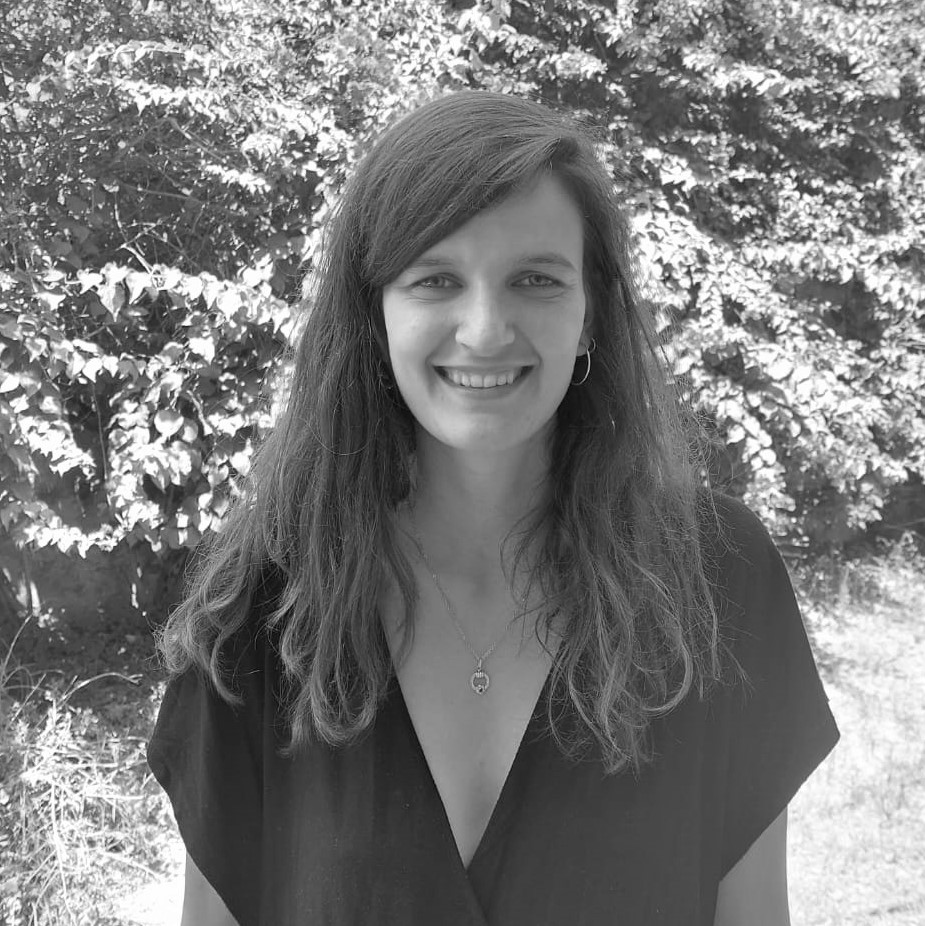
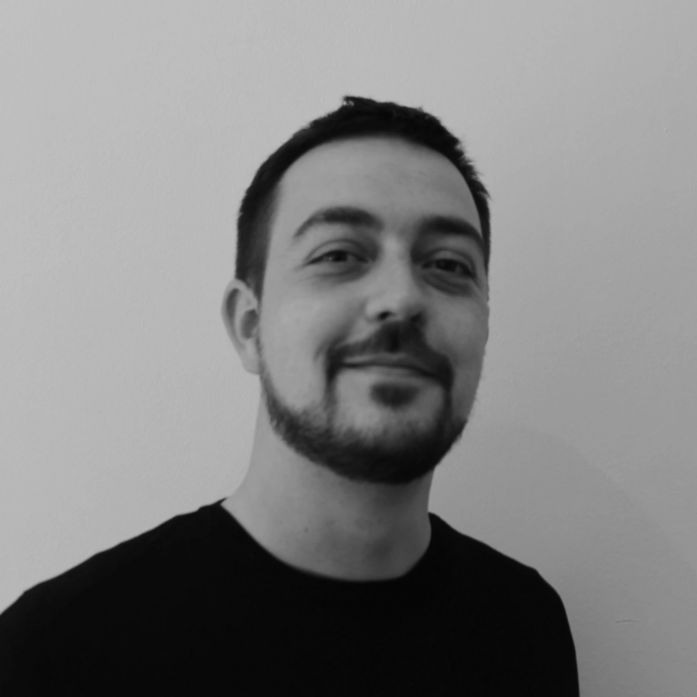
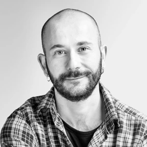

::::::::::::: grid-container-2
::: team-member

[**Andrea Jover**]{style="font-size: 22px;"}

<a href="https://uab.academia.edu/AndreaJoverPujol" target=" blank" style="text-decoration: none;">  </a>  <a href="https://www.researchgate.net/profile/Andrea-Jover-Pujol" target="_blank" style="text-decoration: none;">  </a>

:::

::: team-member

[**Antonina Levantino**]{style="font-size: 22px;"}

<a href="https://ub.academia.edu/AntoninaLevatino" target="_blank" style="text-decoration: none;"> </a> <a href="https://www.researchgate.net/profile/Antonina-Levatino" target="_blank" style="text-decoration: none;">  </a>  <a href="https://scholar.google.it/citations?user=1PzDB04AAAAJ&hl=it" target="_blank" style="text-decoration: none;">  </a>

:::

::: team-member

[**Berta Llos**]{style="font-size: 22px;"}

<a href="https://independent.academia.edu/blloscasadell%C3%A0" target="_blank" style="text-decoration: none;">  </a>  <a href="https://www.researchgate.net/profile/Berta-Llos-Casadella" target="_blank" style="text-decoration: none;">  </a>  <a href="https://scholar.google.com/citations?user=eJjsXaAAAAAJ&hl=en" target="_blank" style="text-decoration: none;">  </a>

:::

::: team-member

[**Martí Manzano**]{style="font-size: 22px;"}

<a href="https://www.researchgate.net/profile/Marti-Manzano" target="_blank" style="text-decoration: none;">  </a> <a href="https://scholar.google.com.my/citations?user=jDBdZS0AAAAJ&hl=en" target="_blank" style="text-decoration: none;">  </a>

:::

::: team-member

[**Marcel Pagès**]{style="font-size: 22px;"}

<a href="https://independent.academia.edu/MarcelPag%C3%A8s" target="_blank" style="text-decoration: none;">  </a>  <a href="https://www.researchgate.net/profile/Marcel-Pages" target="_blank" style="text-decoration: none;">  </a>  <a href="https://scholar.google.com" target="_blank" style="text-decoration: none;"> </a>

:::

::: team-member

[**Lluís Parcerisa**]{style="font-size: 22px;"}

<a href="https://ub.academia.edu/Llu%C3%ADsParcerisa" target="_blank" style="text-decoration: none;">  </a>  <a href="https://www.researchgate.net/profile/Lluis-Parcerisa" target="_blank" style="text-decoration: none;">  </a>  <a href="https://scholar.google.com/citations?user=TfZVZVwAAAAJ&hl=en" target="_blank" style="text-decoration: none;">  </a>

:::

::: team-member

[**Edgar Quilabert**]{style="font-size: 22px;"}

<a href="https://uab.academia.edu/EQuilabert" target="_blank" style="text-decoration: none;">  </a>  <a href="https://www.researchgate.net/profile/Edgar-Quilabert" target="_blank" style="text-decoration: none;">  </a>  <a href="https://scholar.google.es" target="_blank" style="text-decoration: none;">  </a>

:::

::: team-member

[**Andreu Termes**]{style="font-size: 22px;"}

<a href="https://uab.academia.edu/AndreuTermes" target="_blank" style="text-decoration: none;">  </a>  <a href="https://www.researchgate.net" target="_blank" style="text-decoration: none;">  </a>  <a href="https://scholar.google.com" target="_blank" style="text-decoration: none;">  </a>

:::

:::::::::::::